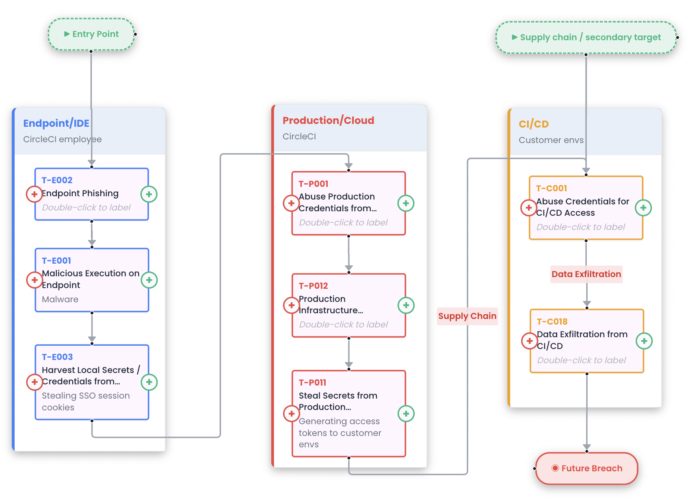

# SDLC Infrastructure Threat Framework - Attack Analysis Guide

## Table of Contents
1. [Introduction](#introduction)
2. [Framework Overview](#framework-overview)
3. [How to Use This Framework](#how-to-use-this-framework)
4. [Case Study: Shai-Hulud-2 Attack](#case-study-shai-hulud-2-attack)
5. [Defending Against Similar Attacks](#defending-against-similar-attacks)
6. [Appendix: Framework Reference](#appendix-framework-reference)

---

## Introduction

### Purpose

This guide helps security teams use the SDLC Infrastructure Threat Framework (SITF) to analyze supply chain attacks against producer organizations. The framework enables you to:

1. Visualize attack stages across SDLC infrastructure components
2. Identify the risks that enabled each attack technique
3. Map risks to appropriate controls to prevent similar attacks
4. Understand attack paths and lateral movement patterns

### Who Should Use This Guide

- **Incident Response Teams** analyzing SDLC infrastructure breaches
- **Security Architects** threat modeling SDLC infrastructure
- **Threat Intelligence Teams** tracking supply chain attack patterns
- **Security Engineers** investigating suspicious activity in SDLC systems

### Framework Philosophy

SITF is attack-centric: Start with an attack, decompose it using the framework, understand what enabled it, and identify controls to prevent recurrence.

SITF focuses on producers: This framework protects organizations that create supply chain components (for internal or external consumption - software vendors, OSS maintainers), not the consumers who use them in production.

---

## Framework Overview

### Key Concept 1: Infrastructure Components

The framework maps attacks across five infrastructure components:

1. **Endpoint/IDE** - Developer workstations and development environments
2. **VCS** - Version Control Systems (GitHub, GitLab, Azure DevOps)
3. **CI/CD** - Continuous Integration/Deployment systems
4. **Registry** - Container and artifact registries (NPM, Docker, PyPI, etc.)
5. **Production/Cloud** - Production infrastructure of the organization

### Key Concept 2: Temporal Flow

Attacks progress through a complete lifecycle with entry and exit points:

```
[Entry Point] -> Initial Access -> Lateral Movement -> Post-Compromise/Impact -> [Exit Point]
```

Entry Point (How the attack began):
- Phishing email to developer
- Compromised third-party dependency
- Exploited vulnerability in public-facing system
- Stolen credentials from previous breach
- Social engineering

Initial Access: Attacker gains foothold in one component
- First successful technique execution
- Establishes presence in SDLC infrastructure
- Examples: Malicious execution on endpoint, PWN request in CI/CD, VCS credential abuse

Lateral Movement: Attacker pivots between components
- Moves from initial foothold to other infrastructure components
- Steals credentials to enable further access
- Examples: CI/CD -> Registry, Endpoint -> Production, Registry -> Endpoint

Post-Compromise/Impact: Attacker achieves objectives
- Data exfiltration (secrets, source code, customer data)
- Supply chain poisoning (publishing malicious artifacts)
- Resource hijacking (cryptomining)
- Infrastructure destruction

**Exit Point (How the attack continues or ends):**
- **Future Breaches:** Attacker stole secrets/credentials for later use
- **Future Persistence:** Attacker left backdoors (malicious packages, runner registration, IAM users)
- **Secondary Supply Chain Attacks:** Compromised artifacts deployed to consumers
- **Ongoing Access:** Attacker maintains access to production/SDLC infrastructure
- **Detection & Containment:** Attack discovered and stopped

**Why Exit Points Matter:**

Exit points show that attacks don't simply "end" - they often create conditions for future attacks:
- Stolen production credentials -> Future breach of production systems
- Backdoored NPM package -> Ongoing supply chain compromise
- Registered malicious runner -> Persistent CI/CD access
- Exfiltrated source code -> Future intellectual property theft

Understanding exit points helps you:
1. **Assess ongoing risk** even after initial containment
2. **Prioritize credential rotation** and secret revocation
3. **Hunt for persistence mechanisms** left by attackers
4. **Monitor for secondary impacts** (compromised consumers)

### Key Concept 3: The Triple Relationship Model

```
                  ||
                  \/
RISKS ──────> TECHNIQUES ──────> CONTROLS
(Why)         (How)              (Defense)
```

**The Technique Library is the Core of SITF**

The framework's power comes from its comprehensive **[Technique Library](TECHNIQUE_LIBRARY.md)** - a catalog of 60+ known attack methods against SDLC infrastructure. Each technique in the library comes pre-mapped to:
- The **risks** that enable it
- The **controls** that prevent or detect it

The technique library is maintained in [`techniques.json`](techniques.json) as the single source of truth, and automatically generates:
- [TECHNIQUE_LIBRARY.md](TECHNIQUE_LIBRARY.md) - Human-readable documentation
- [app/index.html](app/index.html) - Interactive web application

**How to Use the Framework:**

1. Start with the technique - Identify the attack technique from the [Technique Library](TECHNIQUE_LIBRARY.md) (e.g., "T-C003: PWN request", "T-C005: Secret exfiltration from workflow")
2. Understand the risks - The technique entry shows you which underlying risks made it possible
3. Apply the controls - The technique entry shows you which controls would have prevented it

**Example:**
```
Technique: "PWN request / Poisoned Pipeline Execution"
  ↓
Risks that enable it:
  • Allowing PRs from forks
  • Workflow with access to secrets
  • Default workflow permissions set to WRITE
  ↓
Controls that prevent it:
  • Branch protection rules
  • Require explicit approval for workflows from forks
  • Minimal workflow permissions
  • OIDC setup in workflows
```

**The Triple Relationship Explained:**

**TECHNIQUES** (The Starting Point)
- The "How" - specific attack methods
- Organized by: Initial Access, Lateral Movement, Post-Compromise/Impact, Discovery
- The library contains 60+ documented techniques
- Each technique is mapped to specific infrastructure components

**RISKS** (The Enablers)
- The "Why" - underlying conditions that made the technique possible
- Four categories: Credentials, Malicious Dependencies, Misconfigurations, Vulnerabilities
- Multiple risks typically enable a single technique
- Understanding risks helps prioritize fixes

**CONTROLS** (The Defenses)
- The "How to prevent" - security measures that break the attack chain
- Technical controls (tools, configurations)
- Process controls (reviews, approvals)
- Architecture controls (segmentation, isolation)
- Multiple controls typically needed per technique (defense in depth)

---

## How to Use This Framework

### Attack Analysis in Three Steps

1. Identify the Attack Techniques
Look up each attack action in the [Technique Library](TECHNIQUE_LIBRARY.md) to find the matching technique ID (e.g., T-C003, T-E001). Each technique entry provides pre-mapped risks and controls.

2. Map the Attack Flow
Use the SITF Attack Flow Visualizer to create a visual diagram showing:
- Entry points (how the attack began)
- Technique progression across components
- Exit points (ongoing risks after the attack)

3. Extract the Controls Matrix
The visualizer automatically generates a Controls Matrix from your diagram, organizing all security controls by component and attack stage. Export this matrix to prioritize your defenses.

### The SITF Attack Flow Visualizer

The visualizer is an interactive web application for building and analyzing attack flows. It provides an intuitive drag-and-drop interface for mapping attacks across SDLC infrastructure components.


*Example: CircleCI breach visualized using the SITF tool*

**Quick Start:**
- Simply open `app/index.html` in your browser - no server needed!
- The file is a standalone application with all data embedded
- See [app/README.md](app/README.md) for build instructions if modifying techniques

**Key Features:**
- Drag-and-drop interface with 60+ attack techniques
- Expandable technique nodes showing risks (left) and controls (right)
- Auto-populating Controls Matrix organized by component and attack stage
- Export options: PNG, SVG, PDF, and CSV
- Dark/light theme toggle
- Save/Load flows as JSON files

Using the Visualizer:
1. Map the Attack: Drag components and techniques from the palette
2. Show Progression: Connect nodes with arrows to show attack flow
3. Annotate Impact: Double-click arrows to label with impact types
4. View Details: Click expansion buttons to see risks and controls
5. Generate Matrix: Controls Matrix auto-populates from your diagram
6. Export Results: Save as JSON, export as PNG/PDF for reports

Example: The Shai-Hulud-2 case study below demonstrates this complete process with a real supply chain attack.

---


## Case Study: Shai-Hulud-2 Attack

### Attack Overview

The Shai-Hulud-2 attack demonstrates a sophisticated supply chain attack with **two distinct attack paths** - one targeting the producer organization (PostHog, AsyncAPI) and another targeting their consumers. This case study shows how to use SITF to analyze complex, multi-path attacks.

### Attack Flow Visualization

*Complete Shai-Hulud-2.0 attack flow showing dual paths: Producer compromise (left) and Consumer impact (right), with multiple exit points representing ongoing risks*

### Understanding the Dual Attack Paths

Producer Path (Left): Attacker compromises the producer's CI/CD to steal publishing credentials
Consumer Path (Right): Malicious packages execute on consumer endpoints, enabling multiple simultaneous attack paths
Key Insight: A single supply chain attack creates cascading risks across both producers and consumers

---

### Producer Attack Path

#### Stage 1: Initial Access - PWN Request (T-C003)

**Component:** CI/CD (GitHub Actions)

**What Happened:**
Attacker submitted a malicious pull request to the AsyncAPI/PostHog repositories that triggered GitHub Actions workflows with elevated privileges.

**Risks Exploited:**
- Misconfigured repo - visibility
- Misconfigured VCS access - external contributors
- Allowing PRs from forks
- Usage of pull_request_target/workflow_run
- Default workflow permissions set to WRITE
- Workflows with access to secrets

**Controls That Would Have Prevented This:**
- Branch protection rules (VCS)
- Private repo (VCS)
- CICD scanning tools
- Require explicit approval for workflows from forks (VCS)
- Minimal workflow permissions
- Default workflow permissions not set to approve PRs

#### Stage 2: Lateral Movement - Secret Exfiltration (T-C005)

**Component:** CI/CD -> Registry

**What Happened:**
The malicious workflow exfiltrated NPM publishing tokens from GitHub Actions secrets.

**Risks Exploited:**
- Workflow with access to secrets
- No runtime monitoring
- Secrets in workflow logs
- Overprivileged secrets

**Controls That Would Have Prevented This:**
- OIDC setup in workflows
- Runtime agent on runner
- Secret scanning
- Minimal workflow permissions
- Log sanitization

#### Stage 3: Lateral Movement - Publishing Malicious Package (T-R004)

**Component:** Registry (NPM)

**What Happened:**
Attacker published malicious versions of asyncio and posthog packages using stolen credentials.

**Risks Exploited:**
- Overprivileged NPM token
- Lack of provenance
- Lack of trusted publishing
- No package signing

**Controls That Would Have Prevented This:**
- Trusted publishing
- Provenance attestation
- MFA for registry account
- Package signing and verification
- OIDC for publishing

**Exit Point:** Secondary Supply Chain Attack (malicious packages now available to all consumers)

---

### Consumer Attack Path

#### Stage 4: Initial Access - Malicious Execution (T-E001)

**Component:** Endpoint (Consumer Developer Machines)

**What Happened:**
Consumers installed the compromised packages, executing malicious code on their developer workstations.

**Risks Exploited:**
- Using untrusted IDE extensions
- Using untrusted software packages on endpoints
- No EDR/antivirus installed
- Lack of application sandboxing

**Controls That Would Have Prevented This:**
- EDR on endpoint
- IDE sandboxing
- Mandating signed extensions
- Package version pinning
- Application whitelisting

#### Stage 5: Post-Compromise - Harvest Local Secrets (T-E003)

**Component:** Endpoint

**What Happened:**
Malicious code harvested credentials stored on consumer developer machines.

**Risks Exploited:**
- Credentials stored in plaintext on endpoints
- Production credentials on developer machines
- No local DLP
- SSH keys without passwords
- Cloud credentials in environment variables

**Controls That Would Have Prevented This:**
- Local DLP
- EDR on endpoint
- Credential manager enforcement
- No production credentials on endpoints
- Encrypted credential storage

---

#### Stage 6: Secret Exfiltration from Personal Repo (T-V004)

**Component:** VCS

**What Happened:**
Stolen credentials included VCS tokens, allowing access to personal repositories containing work-related secrets.

**Risks Exploited:**
- Misconfigured repo - visibility
- Using personal repos for work
- Org members with public repos containing work content

**Controls That Would Have Prevented This:**
- Secret scanning on personal repos
- Policy against using personal repos for work
- Detection infra on audit logs
- Security awareness training

**Exit Point:** Future Breach (stolen VCS credentials enable future attacks)

---

#### Stage 7: Register Local Machine as Runner (T-E006)

**Component:** Endpoint -> CI/CD

**What Happened:**
Compromised endpoints registered as self-hosted GitHub Actions runners, establishing persistent access to CI/CD infrastructure.

**Risks Exploited:**
- Ability to register arbitrary machines as runners
- No runner registration approval process
- Runner registration tokens not protected

**Controls That Would Have Prevented This:**
- Using managed runners only
- Runner registration approval workflow
- Runner registration token protection
- Network segmentation (runners isolated from endpoints)

**Exit Point:** Ongoing Access (persistent backdoor in CI/CD infrastructure)

---

#### Stage 8: Re-compromise CI/CD (T-C005)

**Component:** Endpoint -> CI/CD -> Registry

**What Happened:**
Stolen credentials from consumer endpoints could be used to compromise their CI/CD systems, repeating the attack cycle.

**Risks Exploited:**
- Workflow with access to secrets
- No runtime monitoring
- Secrets in workflow logs
- Overprivileged secrets

**Controls That Would Have Prevented This:**
- OIDC setup in workflows
- Runtime agent on runner
- Secret scanning
- Minimal workflow permissions
- Log sanitization

**This leads back to Stage 3 (T-R004):** Publishing more malicious packages, creating a cascading supply chain attack.

**Exit Point:** Secondary Supply Chain Attack (the cycle repeats with new victims)

---

### Complete Risk-Technique-Control Mapping

| Stage | Component | Technique | Key Risks | Key Controls |
|-------|-----------|-----------|-----------|--------------|
| **Producer Path** |
| 1 | CI/CD | T-C003: PWN Request | • Allowing PRs from forks<br>• Workflow with secrets<br>• WRITE permissions | • Branch protection (VCS)<br>• Private repo<br>• Minimal permissions<br>• CICD scanning |
| 2 | CI/CD->Registry | T-C005: Secret Exfiltration | • Workflow with secrets<br>• No runtime monitoring<br>• Overprivileged secrets | • OIDC setup<br>• Runtime agent<br>• Secret scanning<br>• Log sanitization |
| 3 | Registry | T-R004: Malicious Package | • Overprivileged token<br>• No provenance<br>• No trusted publishing | • Trusted publishing<br>• Provenance attestation<br>• MFA<br>• Package signing |
| **Consumer Path** |
| 4 | Endpoint | T-E001: Malicious Execution | • Untrusted packages<br>• No EDR<br>• No sandboxing | • EDR<br>• IDE sandboxing<br>• Package pinning<br>• Application whitelisting |
| 5 | Endpoint | T-E003: Harvest Secrets | • Plaintext credentials<br>• Production creds on endpoint<br>• No DLP | • Local DLP<br>• EDR<br>• Credential manager<br>• No production creds on endpoints |
| 6 | VCS | T-V004: Personal Repo Secrets | • Using personal repos for work<br>• Public repos with work content | • Secret scanning on personal repos<br>• Policy enforcement<br>• Detection infra |
| 7 | Endpoint->CI/CD | T-E006: Register Runner | • Arbitrary runner registration<br>• No approval process | • Managed runners only<br>• Registration approval<br>• Network segmentation |
| 8 | Endpoint->CI/CD | T-C005: Secret Exfiltration | • Workflow with secrets<br>• No runtime monitoring | • OIDC setup<br>• Runtime agent<br>• Secret scanning |

### Key Takeaways

1. Dual attack surface: Supply chain attacks impact both producers (who create components) and consumers (who use them)
2. Multiple exit points: The attack doesn't "end" - it creates three distinct ongoing risks (Future Breach, Ongoing Access, Secondary Supply Chain Attack)
3. Cascading impact: Consumer compromises can trigger new supply chain attacks, creating a self-perpetuating cycle
4. Defense requires depth: No single control stops the attack - multiple controls at each stage are needed
5. Credential theft is the pivot mechanism: Stolen secrets enable lateral movement between all components

---

## Defending Against Similar Attacks

### Step 1: Identify Your Attack Surface

Map your SDLC infrastructure to the five components:

```markdown
My Organization's SDLC Infrastructure:
- Endpoint/IDE: [List your setup]
- VCS: [GitHub/GitLab/etc.]
- CI/CD: [GitHub Actions/Jenkins/etc.]
- Registry: [NPM/Docker Hub/etc.]
- Production: [AWS/Azure/GCP/etc.]
```

### Step 2: Assess Pivot Paths

Identify how an attacker could move between your components:

```markdown
Potential Pivot Paths:
1. Endpoint -> CI/CD: [How? Credentials? Runner registration?]
2. CI/CD -> Registry: [How? Tokens in secrets? Workflow permissions?]
3. Registry -> Endpoint: [How? Package installation? Image pulls?]
4. CI/CD -> Production: [How? Deployment credentials? Runner network access?]
5. Endpoint -> Production: [How? Cloud credentials? VPN access?]
```

### Step 3: Map Risks to Your Environment

For each component, assess which risks apply:

```markdown
CI/CD Risks in My Environment:
- [ ] Workflows with access to secrets: YES/NO
- [ ] Default permissions set to WRITE: YES/NO
- [ ] Allowing PRs from forks: YES/NO
- [ ] Using unpinned third-party actions: YES/NO
- [ ] Self-hosted runners: YES/NO
- [ ] Production credentials in workflows: YES/NO
```

### Step 4: Prioritize Controls

Focus on controls that break the most critical attack paths:

**High Priority (Break Critical Paths):**
- OIDC in workflows (eliminates credential theft from CI/CD)
- Network segmentation (prevents SDLC->Production pivot)
- Trusted publishing (prevents Registry compromise)
- EDR on endpoints (detects malicious execution)

**Medium Priority (Add Defense Layers):**
- Branch protection rules
- Minimal workflow permissions
- Action pinning
- Secret scanning

**Low Priority (Optimization):**
- Workflow ordering
- Cache artifact signing
- IDE extension whitelist

### Step 5: Test Your Defenses

Simulate attack paths to verify controls:

```markdown
Test 1: Can a malicious PR trigger a workflow with secrets?
- Expected: NO (branch protection + approval required)
- Actual: [Test result]

Test 2: Can a compromised workflow access production?
- Expected: NO (OIDC + network segmentation)
- Actual: [Test result]

Test 3: Can a malicious package execute on endpoints?
- Expected: DETECTED (EDR alerts)
- Actual: [Test result]
```

---

## Appendix: Framework Reference

### [Technique Library](TECHNIQUE_LIBRARY.md)
The comprehensive catalog of 60+ attack techniques with pre-mapped risks and controls. This is your primary reference for:
- Complete technique triplets (Technique -> Risks -> Controls)
- Techniques organized by component (Endpoint, VCS, CI/CD, Registry, Production)
- Quick reference index by attack stage
- Practical examples of using the library for attack analysis

### [SITF Attack Flow Visualizer](app/README.md)
Interactive web application for building and analyzing attack flows:
- Standalone HTML file - just open `app/index.html` in your browser
- Drag-and-drop interface with 60+ techniques
- Visual representation of attack paths and lateral movement
- Auto-populating Controls Matrix
- Export capabilities (PNG, SVG, PDF, CSV)

Source of Truth: [`techniques.json`](techniques.json)
- Machine-readable format for all technique data
- Edit this file to add or modify techniques
- Run `python3 app/build-techniques.py` to regenerate documentation and web app

### Real-World Attack Examples

Attacks Mapped to SITF:
- Shai-Hulud-2 (2024): Complete supply chain attack cycle (VCS -> CI/CD -> Registry -> Endpoint)
- CircleCI breach (2023): CI/CD -> Production pivot via stolen credentials
- Codecov (2021): CI/CD -> Registry compromise via modified build script -> Endpoint