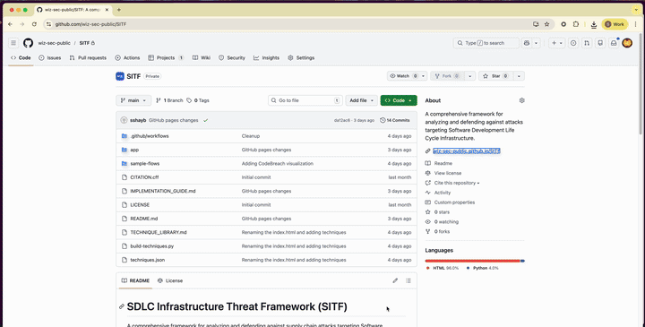

# SDLC Infrastructure Threat Framework (SITF)

A comprehensive framework for analyzing and defending against supply chain attacks targeting Software Development Lifecycle infrastructure.

## Quick Start

### 🌐 Try Online (No Installation Required)

🎨 **[Launch the Flow Builder](https://wiz-sec-public.github.io/SITF/visualizer.html)** - Interactive tool for mapping attack flows

🔍 **[Explore Techniques Visually](https://wiz-sec-public.github.io/SITF/techniques-library.html)** - Interactive visual explorer with filtering and search

### 📁 Use Locally

🎨 **Launch builder locally** - Download [visualizer.html](app/visualizer.html) locally, open and build offline

🔍 **Explore techniques** - Download [techniques-library.html](app/techniques-library.html) locally, open and browse techniques offline

### 📖 Documentation

📖 **[Read the Implementation Guide](IMPLEMENTATION_GUIDE.md)** - Complete methodology, case studies, and usage instructions

## What is SITF?

SITF helps security teams analyze supply chain attacks by:
- Visualizing attack stages across SDLC components (Endpoint, VCS, CI/CD, Registry, Production)
- Identifying the risks that enabled each attack technique
- Mapping risks to appropriate security controls
- Understanding attack paths and lateral movement patterns

## Framework Components

- 5 Infrastructure Components: Endpoint/IDE, VCS, CI/CD, Registry, Production/Cloud
- Over 70 Attack Techniques: Pre-mapped with enabling risks and preventive controls
- Interactive Visualizer: Drag-and-drop interface for building attack flow diagrams
- Real-World Case Studies: CircleCI breach, Shai-Hulud-2, Codecov

## Documentation

- [IMPLEMENTATION_GUIDE.md](IMPLEMENTATION_GUIDE.md) - Start here for complete framework overview
- [TECHNIQUE_LIBRARY.md](TECHNIQUE_LIBRARY.md) - Reference catalog of all techniques
- [techniques.json](techniques.json) - Machine-readable source of truth for all techniques
- [app/README.md](app/README.md) - Visualizer setup and usage

## Contributing

To add or modify techniques:

1. Edit [`techniques.json`](techniques.json) - the source of truth
2. Run `python3 build-techniques.py` to regenerate documentation and web app
3. Commit all changes (JSON, Markdown, and HTML)
4. Submit PR or use locally

The build script generates:
- `TECHNIQUE_LIBRARY.md` - Human-readable documentation
- `app/techniques-library.html` - Visual technique explorer with filtering and search
- `app/visualizer.html` - Interactive attack flow builder

---

**Target Audience**: Incident Response Teams, Security Architects, Threat Intelligence Teams, Security Engineers

**Focus**: Protecting producer organizations (software vendors, OSS maintainers) who create supply chain components
