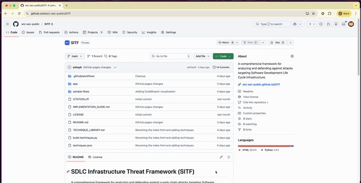
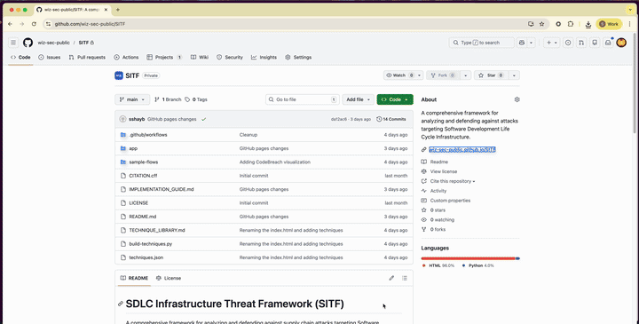

# SDLC Infrastructure Threat Framework (SITF)

A comprehensive framework for analyzing and defending against attacks targeting Software Development Lifecycle infrastructure.

## Quick Start

### 🌐 Try Online (No Installation Required)

**[Launch the Flow Builder](https://wiz-sec-public.github.io/SITF/visualizer.html)** - Interactive tool for mapping attack flows

**[Explore Techniques Visually](https://wiz-sec-public.github.io/SITF/techniques-library.html)** - Interactive visual explorer with filtering and search

### 🤖 Use with Claude AI

**Automated Attack Flow Generation** - Use Claude skills to automatically generate SITF-compliant attack flows and technique proposals:

| Skill | Purpose |
|-------|---------|
| `/attack-flow` | Generate flows from public incidents and breach reports |
| `/red-team-flow` | Generate flows from red team/pentest engagement reports |
| `/technique-proposal` | Create new technique definitions when gaps are identified |

See **[SKILLS.md](SKILLS.md)** for detailed usage instructions and examples.

### 📁 Use Locally

**Launch builder locally** - Download [visualizer.html](app/visualizer.html) locally, open and build offline

**Explore techniques** - Download [techniques-library.html](app/techniques-library.html) locally, open and browse techniques offline

### 📖 Documentation

**[Read the Implementation Guide](IMPLEMENTATION_GUIDE.md)** - Complete methodology, case studies, and usage instructions

## What is SITF?

SITF helps security teams analyze supply chain attacks by:
- Visualizing attack stages across SDLC components (Endpoint, VCS, CI/CD, Registry, Production)
- Identifying the risks that enabled each attack technique
- Mapping risks to appropriate security controls
- Understanding attack paths and lateral movement patterns

## Framework Components

- **5 Infrastructure Components**: Endpoint/IDE, VCS, CI/CD, Registry, Production/Cloud
- **75+ Attack Techniques**: Pre-mapped with enabling risks and security controls
- **Dual Control Types**: Protective controls (prevent attacks) and Detective controls (detect attacks)
- **Framework Mappings**: Controls mapped to industry frameworks (OWASP SPVS)
- **Interactive Visualizer**: Drag-and-drop interface for building attack flow diagrams
- **Real-World Case Studies**: CircleCI breach, Shai-Hulud-2, TrustWallet, tj-actions, CodeBreach, s1ngularity

## Documentation

- [IMPLEMENTATION_GUIDE.md](IMPLEMENTATION_GUIDE.md) - Start here for complete framework overview
- [TECHNIQUE_LIBRARY.md](TECHNIQUE_LIBRARY.md) - Reference catalog of all techniques
- [techniques.json](techniques.json) - Machine-readable source of truth for all techniques
- [app/README.md](app/README.md) - Visualizer setup and usage
- [SKILLS.md](SKILLS.md) - Claude AI skills documentation and usage examples

## Claude AI Skills

SITF includes Claude AI skills for automated attack flow generation. See **[SKILLS.md](SKILLS.md)** for complete documentation.

| Skill | Input | Output |
|-------|-------|--------|
| `/attack-flow` | Incident name, URL, or web search | `sample-flows/<name>.json` |
| `/red-team-flow` | Engagement report (file/URL/text) | `flows/red-team/<name>.json` |
| `/technique-proposal` | Gap description | `technique-proposals/<id>.md` |

## Contributing

### Adding or Modifying Techniques

**Manual Method:**
1. Edit [`techniques.json`](techniques.json) - the source of truth
2. Run `python3 build-techniques.py` to regenerate documentation and web app
3. Commit all changes (JSON, Markdown, and HTML)
4. Submit PR or use locally

**Automated Method (with Claude):**
1. Use `/technique-proposal` to generate a complete technique definition
2. Add the generated JSON to [`techniques.json`](techniques.json)
3. Run `python3 build-techniques.py` to regenerate documentation
4. Submit PR with the proposal rationale

The build script generates:
- `TECHNIQUE_LIBRARY.md` - Human-readable documentation
- `app/techniques-library.html` - Visual technique explorer with filtering and search
- `app/visualizer.html` - Interactive attack flow builder

### Creating Attack Flows

**Manual Method:**
- Use the [online visualizer](https://wiz-sec-public.github.io/SITF/visualizer.html) to build flows interactively

**Automated Method (with Claude):**
- Use `/attack-flow <attack-name> websearch` to automatically generate flows from incident reports

---

**Target Audience**: Incident Response Teams, Security Architects, Threat Intelligence Teams, Security Engineers

**Focus**: Protecting producer organizations (software vendors, OSS maintainers) who create supply chain components

---

Starting April 14 2026, SITF is licensed under CC BY-NC 4.0. Versions prior to this date remain under CC BY-NC-ND 4.0.
